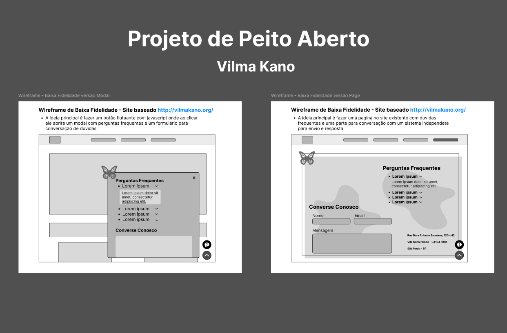
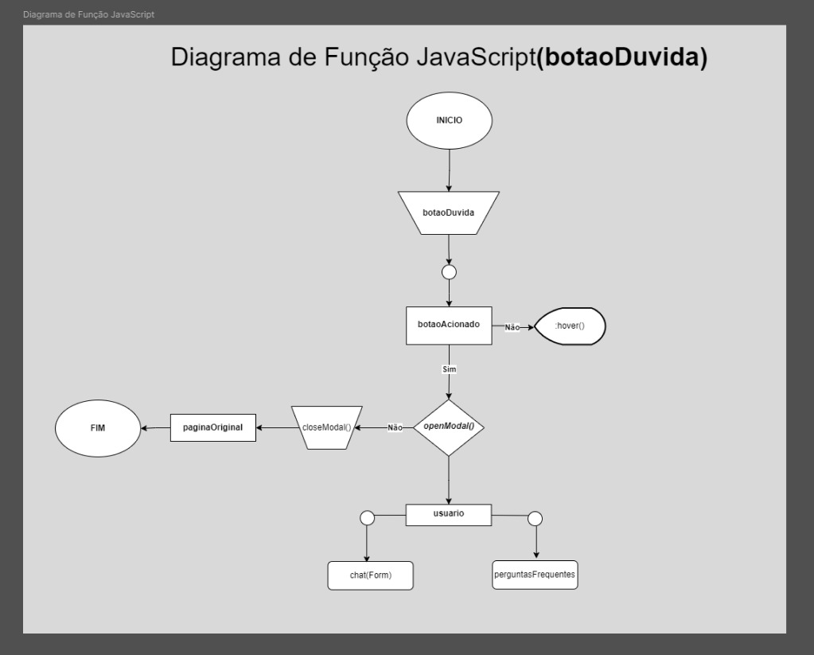

# Projeto de Peito Aberto - ONG Vilma Kano

Através da faculdade, tivemos a oportunidade de ajudar a **ONG Vilma Kano** utilizando nossas habilidades de desenvolvimento. Durante o briefing com a cliente, foi solicitado um botão flutuante que exibisse um modal com um FAQ e um espaço para trocar mensagens sobre dúvidas.
Decidimos faze-lo em javascript por ser uma interação.

## Wireframe

- **Demos duas opções para a cliente:**

1. **Modal** com o FAQ e um formulário para conversação.
2. **Página** à parte com o chat e a seção de FAQ.

## Fluxograma

- **Após a cliente escolher a versão do modal**, foi feito um fluxograma para explicar como funcionaria a codificação.

