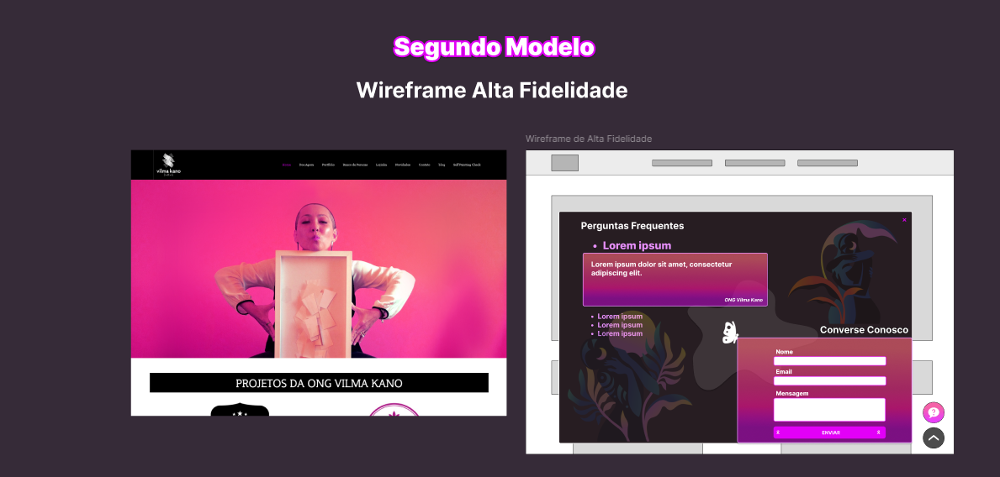
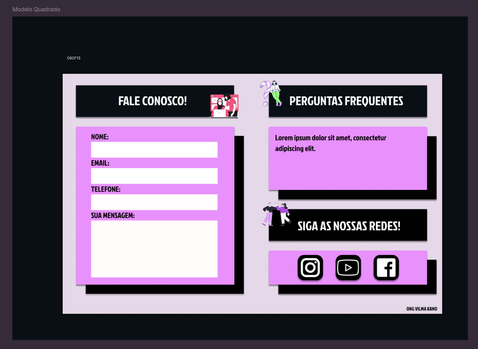
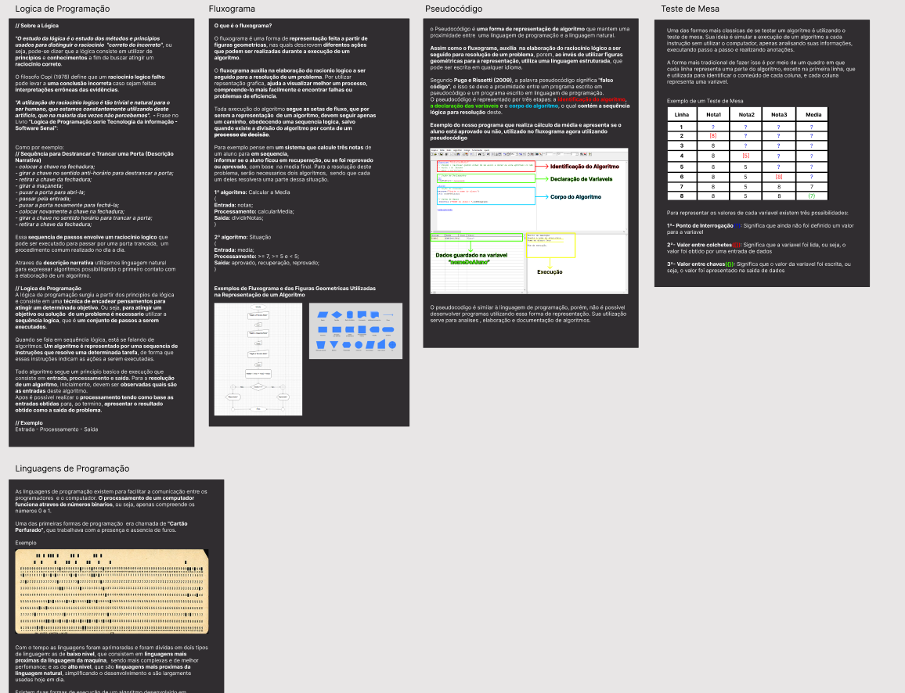
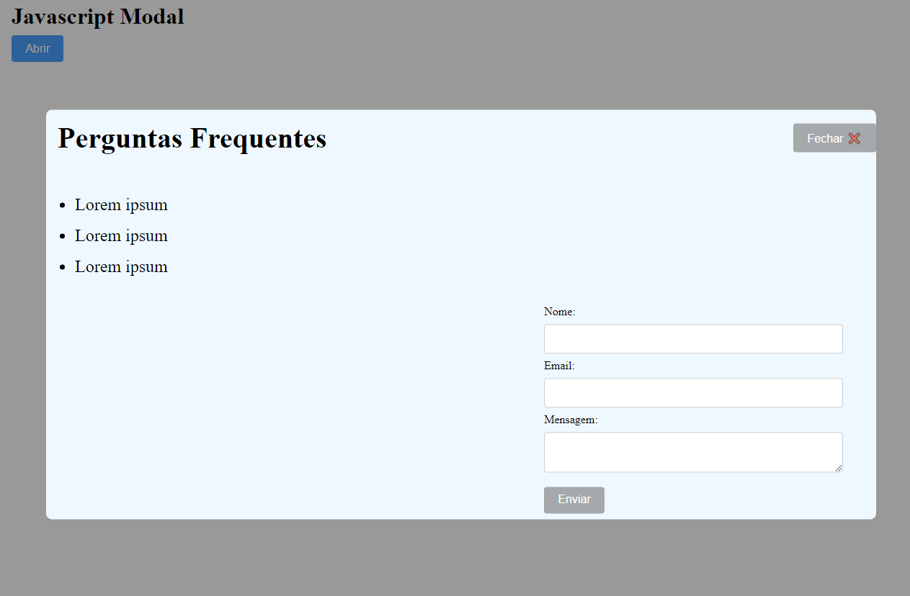
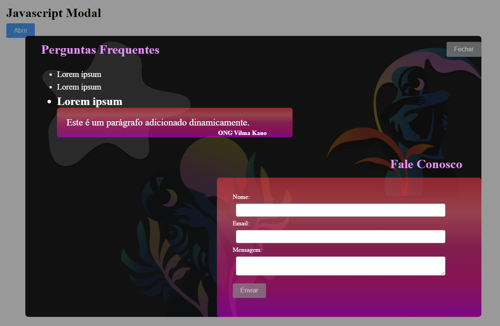
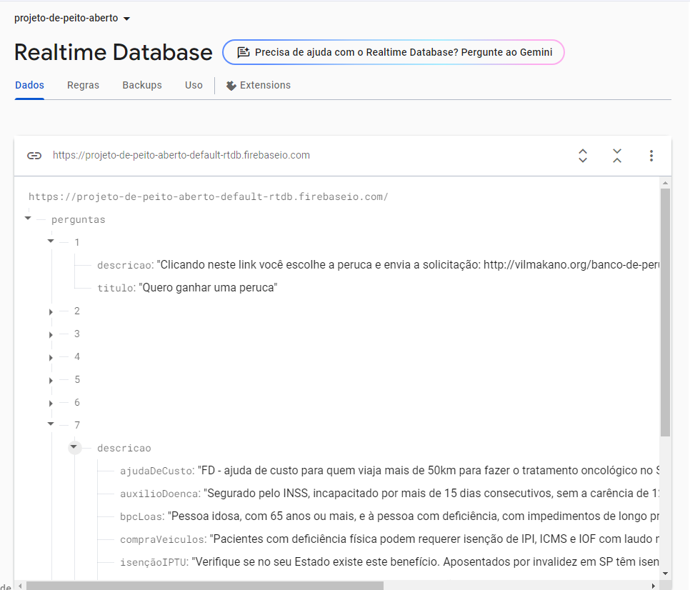
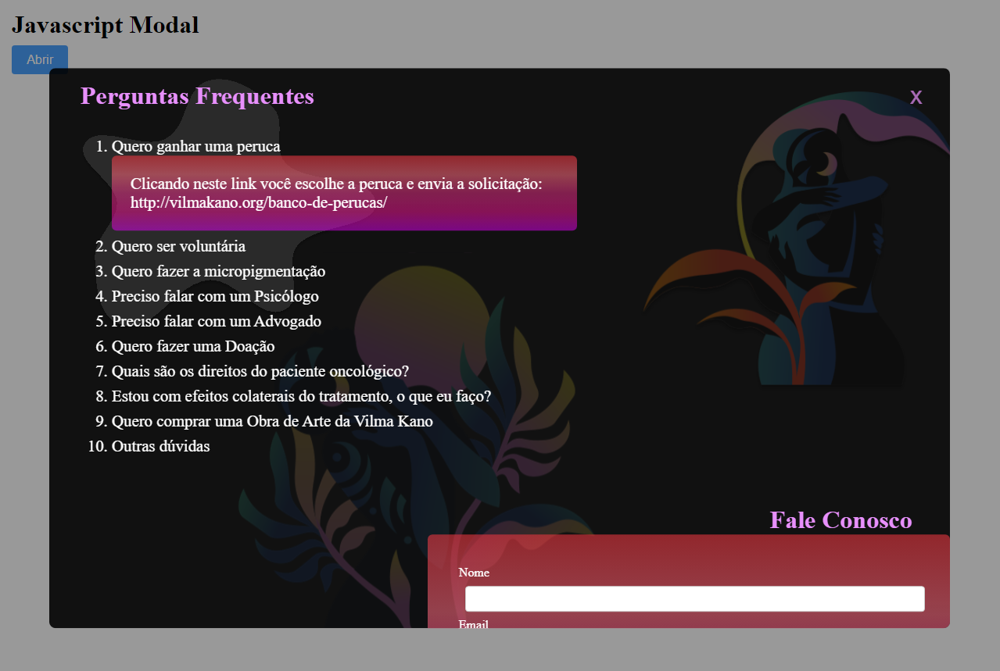

# Projeto de Peito Aberto - ONG Vilma Kano

Através da faculdade, tivemos a oportunidade de ajudar a **ONG Vilma Kano** utilizando nossas **habilidades em desenvolvimento**. Durante o briefing com a cliente, foi solicitado um **botão flutuante que exibisse um modal** com um FAQ e um espaço para trocar mensagens sobre dúvidas.
Decidimos faze-lo em **javascript, html** e **css** por ser uma interação e se tratar de uma aplicação web.

# Membros - Uninove VP

<a href="https://github.com/tanaka-11">Marina Tanaka <b>(3024200441)</b></a>

<a href="https://github.com/eoscar76">Erick Oscar <b>(3024202631)</b></a>

<a href="https://github.com/KathleenFerreira18">Kathleen Ferreira <b>(3022101127)</b></a>

## Wireframe

**Demos duas opções para a cliente:**

1. **Modal** com o FAQ e um formulário para conversação.
2. **Página** à parte com o chat e a seção de FAQ.

## Modal

Após briefing realizado a cliente optou pela opção de **um modal javascript** e autorizou o termo de abertura do projeto **(TAP)**

#### Link - [TAP (Termo de Abertura de Projeto)](TAP_TERMO_DE_ABERTURA_DE_PROJETO_assinado.pdf)

## Wireframe de Alta Fidelidade

Pensando na proposta da cliente, nosso **primeiro modelo** foi feito visando a **acessibilidade**, para que fosse intuitivo mesmo **para pessoas sem afinidade tecnológica**. Testamos diversas paletas de cores com a ferramenta **"Adobe Color"** para conseguir uma paleta **AAA** baseada nas **Diretrizes de Acessibilidade para Conteúdo da Web (WCAG)**

Como tinhamos dois modelos, perguntamos para a cliente e ela escolheu nosso modelo mais detalhado. Discutimos com a equipe e decidimos basear o modelo na paleta e no estilo do site já existente porem matendo o mesmo **foco em acessibilidade**

## Fluxograma

Foi feito um fluxograma para explicar como funcionaria a **codificação do modal** e alinhar a equipe do que precisaria ser feito

## Primeiro Layout Codificado

Por se tratar de um desafio, devido ao fato de termos uma equipe pequena e apenas um desenvolvedor com noção de código, optamos por revisar conceitos sobre **lógica de programação**, **fluxogramas**, **pseudocódigo**, **testes de mesa**, **linguagens de programação em geral**, **modais** e sobre as linguagens específicas **JavaScript**, **HTML** e **CSS** para que toda a equipe estivesse preparada para a parte de codificação do projeto

Nosso primeiro layout codificado

## Segundo Layout Codificado

Seguindo com o modelo escolhido pela cliente, nossos desenvolvedores projetaram um prototipo codificado do front-end

## Terceiro Layout Codificado

Após a codificação do front-end, nossa equipe discutiu e escolhemos integrar o Firebase como back-end. O Firebase é uma plataforma Backend-as-a-Service (BaaS) baseada na infraestrutura do Google, que escala automaticamente. Como BaaS, ele oferece uma estrutura de back-end pronta e gerenciada, permitindo que os desenvolvedores se concentrem no front-end, enquanto o back-end (banco de dados, autenticação, etc.) é fornecido e administrado pela plataforma. Isso evita a necessidade de configurar e manter servidores, tornando o desenvolvimento mais rápido e eficiente.

