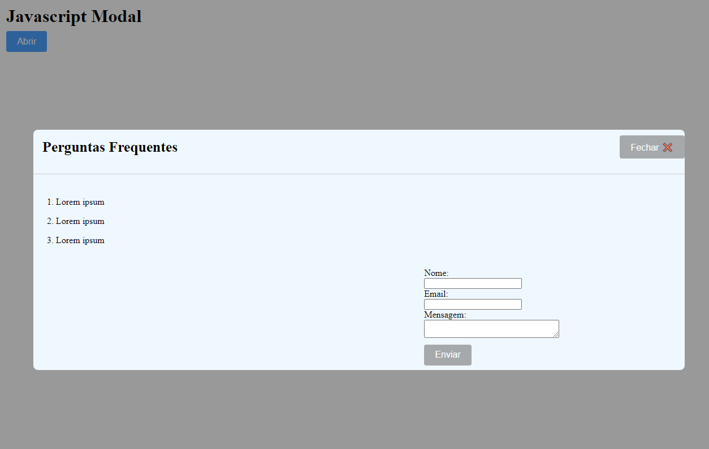

# Projeto de Peito Aberto - ONG Vilma Kano

Através da faculdade, tivemos a oportunidade de ajudar a **ONG Vilma Kano** utilizando nossas habilidades de desenvolvimento. Durante o briefing com a cliente, foi solicitado um botão flutuante que exibisse um modal com um FAQ e um espaço para trocar mensagens sobre dúvidas.
Decidimos faze-lo em javascript por ser uma interação e se tratar de uma aplicação web.

# Membros

- Marina Tanaka **(3024200441)**
- Erick Oscar **(3024202631)**
- Kathleen Ferreira **(3022101127)**

## Wireframe

- **Demos duas opções para a cliente:**

1. **Modal** com o FAQ e um formulário para conversação.
2. **Página** à parte com o chat e a seção de FAQ.

## Modal

Após briefing realizado a cliente otpou pela opção de **um modal javascript** e autorizou o termo de abertura do projeto **(TAP)**

#### Link - [TAP (Termo de Abertura de Projeto)](TAP_TERMO_DE_ABERTURA_DE_PROJETO_assinado.pdf)

## Wireframe de Alta Fidelidade

## Fluxograma

- **Após a cliente escolher a versão do modal**, foi feito um fluxograma para explicar como funcionaria a codificação.

## Começo do Codigo

## Primeira linhas escritas

## Primeiro layout

